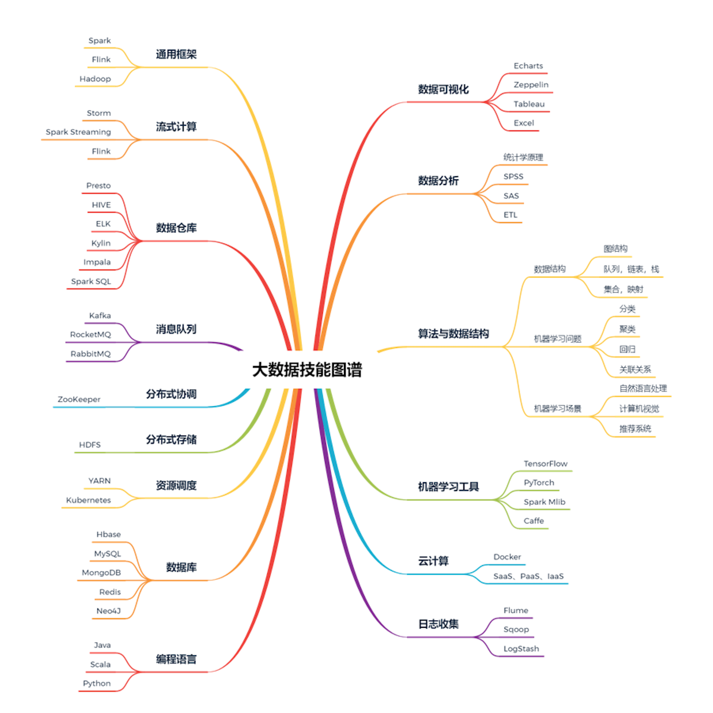

# 一 备战面试

## 1.1 如何准备面试
### 1.1.1 准备自己的自我介绍
我觉得一个好的自我介绍应该包含这几点要素：

1. 主要的技术栈和擅长的领域扬长避短；
3. 重点突出自己的能力；

一般建议的是准备好两份自我介绍：一份对hr说的，主要讲能突出自己的经历，会的编程技术一语带过；另一份对技术面试官说的，主要讲自己会的技术细节和项目经验。

**社招：**

> 面试官，您好！我叫独秀儿。我目前有1年半的工作经验，熟练使用Spring、MyBatis等框架、了解 Java 底层原理比如JVM调优并且有着丰富的分布式开发经验。离开上一家公司是因为我想在技术上得到更多的锻炼。在上一个公司我参与了一个分布式电子交易系统的开发，负责搭建了整个项目的基础架构并且通过分库分表解决了原始数据库以及一些相关表过于庞大的问题，目前这个网站最高支持 10 万人同时访问。工作之余，我利用自己的业余时间写了一个简单的 RPC 框架，这个框架用到了Netty进行网络通信， 目前我已经将这个项目开源，在 Github 上收获了 2k的 Star! 说到业余爱好的话，我比较喜欢通过博客整理分享自己所学知识，现在已经是多个博客平台的认证作者。 生活中我是一个比较积极乐观的人，一般会通过运动打球的方式来放松。我一直都非常想加入贵公司，我觉得贵公司的文化和技术氛围我都非常喜欢，期待能与你共事！

### 1.1.2 搞清楚技术面可能会问哪些方向的问题

你准备面试的话首先要搞清技术面可能会被问哪些方向的问题吧！

**我直接用思维导图的形式展示出来吧！这样更加直观形象一点，细化到某个知识点的话这张图没有介绍到，留个悬念，下篇文章会详细介绍。**

**上面思维导图大概涵盖了技术面试可能会设计的技术，但是你不需要把上面的每一个知识点都搞得很熟悉，要分清主次，对于自己不熟悉的技术不要写在简历上，对于自己简单了解的技术不要说自己熟练掌握！**

### 1.1.3 准备好自己的项目介绍

如果有项目的话，技术面试第一步，面试官一般都是让你自己介绍一下你的项目。你可以从下面几个方向来考虑：

1. 对项目整体设计的一个感受（面试官可能会让你画系统的架构图）
2. 在这个项目中你负责了什么、做了什么、担任了什么角色
3. 从这个项目中你学会了那些东西，使用到了那些技术，学会了那些新技术的使用
4. 另外项目描述中，最好可以体现自己的综合素质，比如你是如何协调项目组成员协同开发的或者在遇到某一个棘手的问题的时候你是如何解决的又或者说你在这个项目用了什么技术实现了什么功能比如：用redis做缓存提高访问速度和并发量、使用消息队列削峰和降流等等。

## 1.2 程序员简历就该这样写

### 1.2.1 写简历必须了解的两大法则

#### STAR法则（Situation Task Action Result）

- **Situation：** 事情是在什么情况下发生；
- **Task:：** 你是如何明确你的任务的；
- **Action：** 针对这样的情况分析，你采用了什么行动方式；
- **Result：** 结果怎样，在这样的情况下你学习到了什么。

简而言之，STAR法则，就是一种讲述自己故事的方式，或者说，是一个清晰、条理的作文模板。不管是什么，合理熟练运用此法则，可以轻松的对面试官描述事物的逻辑方式，表现出自己分析阐述问题的清晰性、条理性和逻辑性。

#### FAB 法则（Feature Advantage Benefit）

- **Feature：** 是什么；
- **Advantage：** 比别人好在哪些地方；
- **Benefit：** 如果雇佣你，招聘方会得到什么好处。

简单来说，这个法则主要是让你的面试官知道你的优势、招了你之后对公司有什么帮助。

### 1.2.2 项目经历怎么写？

简历上有一两个项目经历很正常，但是真正能把项目经历很好的展示给面试官的非常少。对于项目经历大家可以考虑从如下几点来写：

1. 对项目整体设计的一个感受；
2. 在这个项目中你负责了什么、做了什么、担任了什么角色；
3. 从这个项目中你学会了哪些新技术的使用；
4. 另外项目描述中，最好可以体现自己的综合素质。

### 1.2.3 推荐的工具/网站

- [wondercv](https://www.wondercv.com) 在线简历制作
