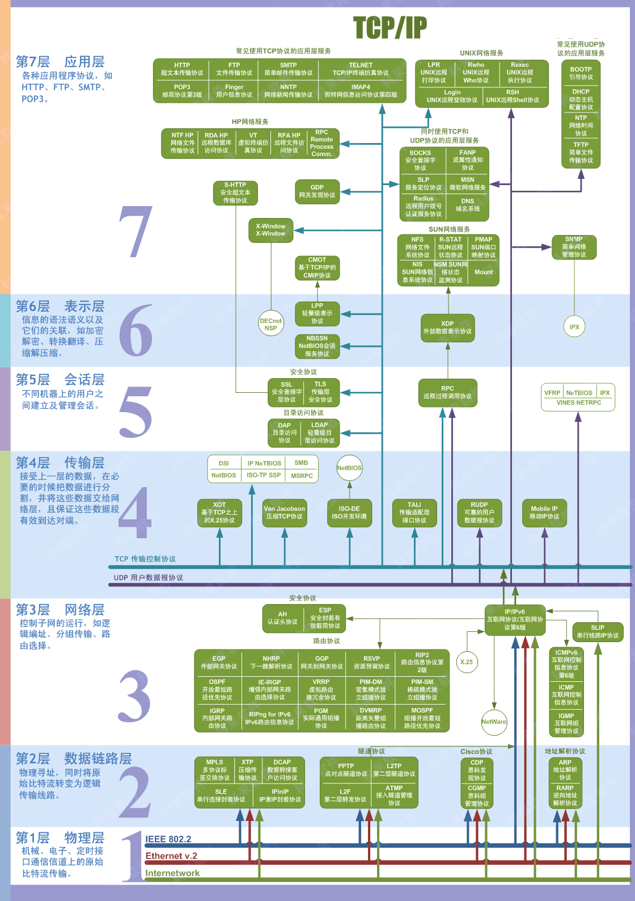

# 三 计算机基础

## 3.1 计算机网络

### 3.1.1 OSI与TCP/IP各层的结构与功能,都有哪些协议?

### 3.1.2 TCP 三次握手和四次挥手(面试常考)

为了准确无误地把数据送达目标处，TCP协议采用了三次握手策略。

#### TCP 三次握手漫画图解

如下图所示，下面的两个机器人通过3次握手确定了对方能正确接收和发送消息(图片来源：《图解HTTP》)。

**简单示意图：**

- 客户端–发送带有 SYN 标志的数据包–一次握手–服务端
- 服务端–发送带有 SYN/ACK 标志的数据包–二次握手–客户端
- 客户端–发送带有带有 ACK 标志的数据包–三次握手–服务端

#### 为什么要三次握手

**三次握手的目的是建立可靠的通信信道，说到通讯，简单来说就是数据的发送与接收，而三次握手最主要的目的就是双方确认自己与对方的发送与接收是正常的。**

第一次握手：Client 什么都不能确认；Server 确认了对方发送正常，自己接收正常

第二次握手：Client 确认了：自己发送、接收正常，对方发送、接收正常；Server 确认了：对方发送正常，自己接收正常

第三次握手：Client 确认了：自己发送、接收正常，对方发送、接收正常；Server 确认了：自己发送、接收正常，对方发送、接收正常

所以三次握手就能确认双发收发功能都正常，缺一不可。

#### 为什么要传回 SYN

接收端传回发送端所发送的 SYN 是为了告诉发送端，我接收到的信息确实就是你所发送的信号了。

> SYN 是 TCP/IP 建立连接时使用的握手信号。在客户机和服务器之间建立正常的 TCP 网络连接时，客户机首先发出一个 SYN 消息，服务器使用 SYN-ACK 应答表示接收到了这个消息，最后客户机再以 ACK(Acknowledgement[汉译：确认字符 ,在数据通信传输中，接收站发给发送站的一种传输控制字符。它表示确认发来的数据已经接受无误。 ]）消息响应。这样在客户机和服务器之间才能建立起可靠的TCP连接，数据才可以在客户机和服务器之间传递。

#### 传了 SYN,为啥还要传 ACK

双方通信无误必须是两者互相发送信息都无误。传了 SYN，证明发送方到接收方的通道没有问题，但是接收方到发送方的通道还需要 ACK 信号来进行验证。

断开一个 TCP 连接则需要“四次挥手”：

- 客户端-发送一个 FIN，用来关闭客户端到服务器的数据传送
- 服务器-收到这个 FIN，它发回一 个 ACK，确认序号为收到的序号加1 。和 SYN 一样，一个 FIN 将占用一个序号
- 服务器-关闭与客户端的连接，发送一个FIN给客户端
- 客户端-发回 ACK 报文确认，并将确认序号设置为收到序号加1

####  为什么要四次挥手

任何一方都可以在数据传送结束后发出连接释放的通知，待对方确认后进入半关闭状态。当另一方也没有数据再发送的时候，则发出连接释放通知，对方确认后就完全关闭了TCP连接。

举个例子：A 和 B 打电话，通话即将结束后，A 说“我没啥要说的了”，B回答“我知道了”，但是 B 可能还会有要说的话，A 不能要求 B 跟着自己的节奏结束通话，于是 B 可能又巴拉巴拉说了一通，最后 B 说“我说完了”，A 回答“知道了”，这样通话才算结束。

上面讲的比较概括，推荐一篇讲的比较细致的文章：[https://blog.csdn.net/qzcsu/article/details/72861891](https://blog.csdn.net/qzcsu/article/details/72861891)

### 3.1.3 TCP,UDP 协议的区别

UDP 在传送数据之前不需要先建立连接，远地主机在收到 UDP 报文后，不需要给出任何确认。虽然 UDP 不提供可靠交付，但在某些情况下 UDP 确是一种最有效的工作方式（一般用于即时通信），比如： QQ 语音、 QQ 视频 、直播等等

TCP 提供面向连接的服务。在传送数据之前必须先建立连接，数据传送结束后要释放连接。 TCP 不提供广播或多播服务。由于 TCP 要提供可靠的，面向连接的传输服务（TCP的可靠体现在TCP在传递数据之前，会有三次握手来建立连接，而且在数据传递时，有确认、窗口、重传、拥塞控制机制，在数据传完后，还会断开连接用来节约系统资源），这一难以避免增加了许多开销，如确认，流量控制，计时器以及连接管理等。这不仅使协议数据单元的首部增大很多，还要占用许多处理机资源。TCP 一般用于文件传输、发送和接收邮件、远程登录等场景。

### 3.1.4 TCP 协议如何保证可靠传输

1. 应用数据被分割成 TCP 认为最适合发送的数据块。 
2. TCP 给发送的每一个包进行编号，接收方对数据包进行排序，把有序数据传送给应用层。 
3. **校验和：** TCP 将保持它首部和数据的检验和。这是一个端到端的检验和，目的是检测数据在传输过程中的任何变化。如果收到段的检验和有差错，TCP 将丢弃这个报文段和不确认收到此报文段。 
4. TCP 的接收端会丢弃重复的数据。 
5. **流量控制：** TCP 连接的每一方都有固定大小的缓冲空间，TCP的接收端只允许发送端发送接收端缓冲区能接纳的数据。当接收方来不及处理发送方的数据，能提示发送方降低发送的速率，防止包丢失。TCP 使用的流量控制协议是可变大小的滑动窗口协议。 （TCP 利用滑动窗口实现流量控制）
6. **拥塞控制：** 当网络拥塞时，减少数据的发送。
7. **ARQ协议：** 也是为了实现可靠传输的，它的基本原理就是每发完一个分组就停止发送，等待对方确认。在收到确认后再发下一个分组。
8. **超时重传：** 当 TCP 发出一个段后，它启动一个定时器，等待目的端确认收到这个报文段。如果不能及时收到一个确认，将重发这个报文段。 

### 3.1.5 在浏览器中输入url地址 ->> 显示主页的过程(面试常考)

百度好像最喜欢问这个问题。

> 打开一个网页，整个过程会使用哪些协议

图解（图片来源：《图解HTTP》）：

总体来说分为以下几个过程:

1. DNS解析
2. TCP连接
3. 发送HTTP请求
4. 服务器处理请求并返回HTTP报文
5. 浏览器解析渲染页面
6. 连接结束

具体可以参考下面这篇文章：

- [https://segmentfault.com/a/1190000006879700](https://segmentfault.com/a/1190000006879700)

### 3.1.6 HTTP是不保存状态的协议,如何保存用户状态?

HTTP 是一种不保存状态，即无状态（stateless）协议。也就是说 HTTP  协议自身不对请求和响应之间的通信状态进行保存。那么我们保存用户状态呢？Session 机制的存在就是为了解决这个问题，Session 的主要作用就是通过服务端记录用户的状态。典型的场景是购物车，当你要添加商品到购物车的时候，系统不知道是哪个用户操作的，因为 HTTP 协议是无状态的。服务端给特定的用户创建特定的 Session 之后就可以标识这个用户并且跟踪这个用户了（一般情况下，服务器会在一定时间内保存这个 Session，过了时间限制，就会销毁这个Session）。

在服务端保存 Session 的方法很多，最常用的就是内存和数据库(比如是使用内存数据库redis保存)。既然 Session 存放在服务器端，那么我们如何实现 Session 跟踪呢？大部分情况下，我们都是通过在 Cookie 中附加一个 Session ID 来方式来跟踪。

**Cookie 被禁用怎么办?**

最常用的就是利用 URL 重写把 Session ID 直接附加在URL路径的后面。

