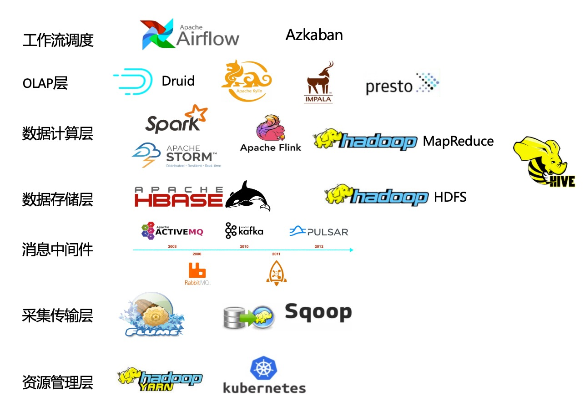

## 1 采集传输层

- **Flume**
  Flume一个分布式、可靠的、高可用的用于数据采集、聚合和传输的系统。常用于日志采集系统中，支持定制各类数据发送方用于收集数据、通过自定义拦截器对数据进行简单的预处理并传输到各种数据接收方如HDFS、HBase、Kafka中。之前由Cloudera开发，后纳入Apache
- **Sqoop**
  Sqoop主要通过一组命令进行数据导入导出的工具，底层引擎依赖于MapReduce，主要用于Hadoop（如HDFS、Hive、HBase）和RDBMS（如mysql、oracle）之间的数据导入导出

## 2 消息中间件

- **Kafka**

分布式消息系统。生产者（producer）——消费者（consumer）模型。提供了类似于JMS的特性，但设计上完全不同，不遵循JMS规范。如kafka允许多个消费者主动拉取数据，而JMS中只有点对点模式消费者才会主动拉取数据。主要应用在数据缓冲、异步通信、汇集数据、系统接偶等方面

- **Pulsar**

pub-sub模式的分布式消息平台，拥有灵活的消息模型和直观的客户端API。类似于Kafka，但Pulsar支持多租户，有着资产和命名空间的概念，资产代表系统里的租户。假设有一个Pulsar集群用于支持多个应用程序，集群里的每个资产可以代表一个组织的团队、一个核心的功能或一个产品线。一个资产可以包含多个命名空间，一个命名空间可以包含任意个主题

- RabbitMQ

RabbitMQ是使用Erlang语言来编写的，并且RabbitMQ是基于AMQP协议的。Erlang语言在数据交互方面性能优秀，有着和原生Socket一样的延迟，这也是RabbitMQ高性能的原因所在。可谓“人如其名”，RabbitMQ像兔子一样迅速。

- RocketMQ

RocketMQ是一款分布式消息中间件，最初是由阿里巴巴消息中间件团队研发并大规模应用于生产系统，满足线上海量消息堆积的需求， 在2016年底捐赠给Apache开源基金会成为孵化项目，经过不到一年时间正式成为了Apache顶级项目；早期阿里曾经基于ActiveMQ研发消息系统， 随着业务消息的规模增大，瓶颈逐渐显现，后来也考虑过Kafka，但因为在低延迟和高可靠性方面没有选择，最后才自主研发了RocketMQ， 各方面的性能都比目前已有的消息队列要好，RocketMQ和Kafka在概念和原理上都非常相似，所以也经常被拿来对比；RocketMQ默认采用长轮询的拉模式， 单机支持千万级别的消息堆积，可以非常好的应用在海量消息系统中。

## 3 数据存储层

- **HBase**
  基于Google Bigtable的开源实现，是一个具有高可靠性、高性能、面向列、可伸缩性、典型的key/value分布式存储的nosql数据库系统，主要用于海量结构化和半结构化数据存储。它介于nosql和RDBMS之间，仅能通过行键（row key）和行键的range来检索数据，行数据存储是原子性的，仅支持单行事务（可通过hive支持来实现多表join等复杂操作）。HBase查询数据功能很简单，不支持join等复杂操作，不支持跨行和跨表事务
- **HDFS**
  分布式文件存储系统，具有高容错（high fault-tolerant）、高吞吐（high throughput）、高可用（high available）的特性。HDFS非常适合大规模数据集上的应用，提供高吞吐量的数据访问，可部署在廉价的机器上。它放宽了POSIX的要求，这样可以实现流的形式访问（文件系统中的数据。主要为各类分布式计算框架如Spark、MapReduce等提供海量数据存储服务，同时HDFS和HBase底层数据存储也依赖于HDFS

## 4 数据计算层

- **Spark**
  Spark是一个快速、通用、可扩展、可容错的、内存迭代式计算的大数据分析引擎。目前生态体系主要包括用于批数据处理的SparkRDD、SparkSQL，用于流数据处理的SparkStreaming、Structured-Streaming，用于机器学习的Spark MLLib，用于图计算的Graphx以及用于统计分析的SparkR，支持Java、Scala、Python、R多种数据语言
- **Flink**
  分布式的大数据处理引擎，可以对有限数据流和无线数据流进行有状态的计算。Flink在设计之初就是以流为基础发展的，然后再进入批处理领域，相对于spark而言，它是一个真正意义上的实时计算引擎

- **Storm**
  由Twitter开源后归于Apache管理的分布式实时计算系统。Storm是一个没有批处理能力的数据流处理计算引擎，storm提供了偏底层的API，用户需要自己实现很多复杂的逻辑
- **MapReduce**
  分布式运算程序的编程框架，适用于离线数据处理场景，内部处理流程主要划分map和reduce两个阶段

- **Hive**
  Hive是基于Hadoop的一个数据仓库工具，可以将结构化的数据文件映射为一张数据库表，并提供HQL语句（类SQL语言）查询功能，存储依赖于HDFS。支持多种计算引擎，如Spark、MapReduce（默认）、Tez；支持多种存储格式，如TextFile、SequenceFile、RCFile、ORC、Parquet（常用）；支持多种压缩格式，如gzip、lzo、snappy（常用）、bzip2

## 5 OLAP引擎

- **Druid**

开源的、基于列存储的、分布式的，适用于实时数据分析的存储系统，能够快速聚合、灵活过滤、毫秒级查询和低延迟数据导入。通过使用Bitmap indexing加速列存储的查询速度，并使用CONCISE算法来对bitmap indexing进行压缩，使得生成的segments比原始文本文件小很多，并且它的各个组成部分之间耦合性低，如果不需要实时数据完全可以忽略实时节点

- **Kylin**

最初由eBayInc.开发并贡献至开源社区的分布式分析引擎。提供Hadoop/Spark之上的SQL查询接口及多维分析（OLAP）能力以支持超大规模数据，它能在亚秒内查询巨大的Hive表。需要使用者对数仓模型有深度了解，并需构建cube。能够与多种可视化工具，如Tableau，PowerBI等，令用户可以使用BI工具对Hadoop数据进行分析

- **Impala**

提供对HDFS、HBase等数据的高性能、低延迟的交互式SQL查询功能的大数据查询分析引擎，由Cloudera开源。它基于Hive，使用Hive的元数据在内存中计算，具有实时、批处理、高并发等优点

- **Presto**

开源的分布式大数据SQL查询引擎，适用于交互式分析查询。可以将多个数据源的数据进行合并，并且可以直接从HDFS读取数据，在使用前不需要大量的ETL操作

## 6 资源管理层

- **Yarn**

Yarn是一个资源调度平台，负责为运算程序分配资源和调度，不参与用户程序内部工作。核心组件包括：ResourceManager（全局资源管理器，负责整个系统的资源管理和分配）、NodeManager（每个节点上的资源和任务管理器）

- **Kubernetes**

又称K8s，为容器化的应用提供资源调度、部署运行、均衡容灾、服务注册、扩容缩容等功能的自动化容器操作的开源平台。具体体现在：自动化容器的部署和复制、随时扩展或收缩容器规模、将容器组织成组，并且提供容器间的负载均衡等。Kubernetes支持docker和Rocket，可以将Docker看成Kubernetes内部使用的低级别组件

## 7 工作流调度器

- **Azkaban**

由LinkedIn开源，相对Oozie更轻量级。用于在一个工作流内以一个特定顺序运行一组任务，通过一种kv文件格式来建立任务之间的依赖关系并为用户提供了易于使用的web界面来维护和跟踪允许任务的工作流

- **Airflow**

Airflow 是一个使用 python 语言编写的 data pipeline 调度和监控工作流的平台。 Airflow 是通过 DAG（Directed acyclic graph 有向无环图）来管理任务流程的任务调度工具， 不需要知道业务数据的具体内容，设置任务的依赖关系即可实现任务调度。这个平台拥有和 Hive、Presto、MySQL、HDFS、Postgres 等数据源之间交互的能力，并且提供了钩子（hook）使其拥有很好地扩展性。 除了一个命令行界面，该工具还提供了一个基于 Web 的用户界面可以可视化管道的依赖关系、监控进度、触发任务等。